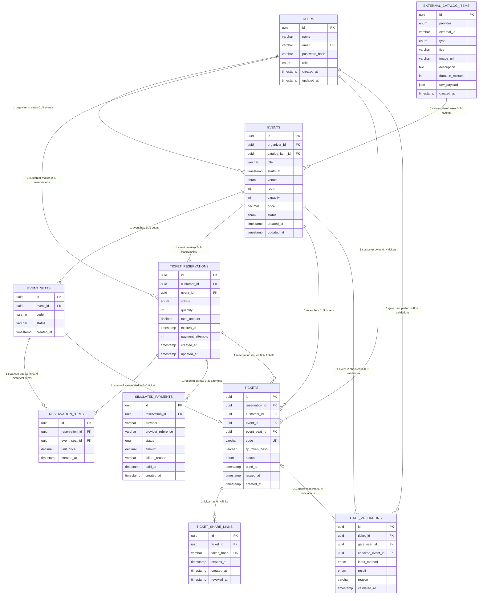

# DER

Nomes técnicos em inglês para facilitar a codificação do back-end, front-end, ORM e banco de dados. A linguagem da aplicação e das explicações continua em português.

> Atualizado para refletir `prisma/schema.prisma` como está hoje (pós-implementação) — ver "Alterações pós-planejamento" no fim do documento pra o que mudou desde a versão original.

Arquivos relacionados:

- `teste-verzel-casos-de-uso-textual-v1.md`
- `teste-verzel-der-dbdiagram-v1.dbml`

## Convenção de Nomes

- Banco, tabelas, colunas, enums e models: inglês.
- Interface, labels, mensagens e documentação para o usuário final: português.
- Explicações técnicas: português, preservando nomes técnicos em inglês.

## DER - Mermaid

## Equivalência com os Conceitos em Português

| Conceito em português | Nome técnico |
| --- | --- |
| Usuários | `users` |
| Itens de catálogo selecionados | `external_catalog_items` |
| Eventos | `events` |
| Assentos do evento | `event_seats` |
| Reservas de ingresso | `ticket_reservations` |
| Itens da reserva | `reservation_items` |
| Pagamentos simulados | `simulated_payments` |
| Ingressos | `tickets` |
| Links de compartilhamento de ingresso | `ticket_share_links` |
| Validações da portaria | `gate_validations` |

## Entidades Rastreáveis aos Casos de Uso

| Entidade | Casos de uso relacionados | Motivo |
| --- | --- | --- |
| `USERS` | UC1 | Autenticação e separação dos papéis Organizador, Cliente e Portaria. |
| `EXTERNAL_CATALOG_ITEMS` | UC3 | Snapshot do show/filme escolhido na API externa. |
| `EVENTS` | UC2, UC4, UC5, UC6, UC7, UC9 | Evento criado, configurado, publicado, gerenciado e consultado. |
| `EVENT_SEATS` | UC11 | Representa os lugares do mapa de assentos do evento, como `A1`, `A2`, `B7`. |
| `TICKET_RESERVATIONS` | UC10 | Representa a tentativa de reserva do Cliente. |
| `RESERVATION_ITEMS` | UC11 | Guarda cada assento selecionado na reserva. Para o MVP de cinema, todo item aponta obrigatoriamente para um assento. |
| `SIMULATED_PAYMENTS` | UC12 | Registra aprovação/recusa do pagamento simulado ou sandbox. |
| `TICKETS` | UC13, UC14, UC16 | Ingresso emitido, exibido com QR Code e validado pela Portaria. |
| `TICKET_SHARE_LINKS` | UC15 | Link gerado para compartilhamento do ingresso. |
| `GATE_VALIDATIONS` | UC16, UC17, UC18, UC19, UC20 | Histórico das validações da portaria e seus resultados. |

## Multiplicidades Principais

| Relacionamento | Multiplicidade | Leitura |
| --- | --- | --- |
| `USERS` -> `EVENTS` | 1 : 0..N | Um Organizador pode criar vários eventos; cada evento pertence a um Organizador. |
| `EXTERNAL_CATALOG_ITEMS` -> `EVENTS` | 1 : 0..N | Um item externo pode ser usado como base para vários eventos. |
| `EVENTS` -> `EVENT_SEATS` | 1 : 1..N | Um evento publicado possui um mapa com vários assentos. |
| `USERS` -> `TICKET_RESERVATIONS` | 1 : 0..N | Um Cliente pode fazer várias reservas; cada reserva pertence a um Cliente. |
| `EVENTS` -> `TICKET_RESERVATIONS` | 1 : 0..N | Um evento pode receber várias reservas; cada reserva é de um evento. |
| `TICKET_RESERVATIONS` -> `RESERVATION_ITEMS` | 1 : 1..N | Toda reserva tem ao menos um item selecionado. |
| `EVENT_SEATS` -> `RESERVATION_ITEMS` | 1 : 0..N | Todo item de reserva aponta para um assento. Um assento pode aparecer em vários itens históricos, como reservas recusadas/canceladas, mas não pode existir mais de uma venda ativa ou paga para o mesmo assento. |
| `TICKET_RESERVATIONS` -> `SIMULATED_PAYMENTS` | 1 : 0..N | Uma reserva pode ter nenhuma ou várias tentativas de pagamento. |
| `TICKET_RESERVATIONS` -> `TICKETS` | 1 : 0..N | Reserva recusada gera zero ingressos; reserva aprovada gera um ou mais. |
| `USERS` -> `TICKETS` | 1 : 0..N | Um Cliente pode possuir vários ingressos. |
| `EVENTS` -> `TICKETS` | 1 : 0..N | Um evento pode ter vários ingressos emitidos. |
| `EVENT_SEATS` -> `TICKETS` | 1 : 0..1 | Cada ingresso emitido aponta pro assento exato que ocupa (`Ticket.eventSeatId`) — uma reserva com vários assentos gera um ticket por assento, não um ticket por reserva. |
| `TICKETS` -> `TICKET_SHARE_LINKS` | 1 : 0..N | Um ingresso pode ter vários links gerados ou nenhum. |
| `TICKETS` -> `GATE_VALIDATIONS` | 0..1 : 0..N | Validação inválida pode não encontrar ingresso; ingresso existente pode ter várias tentativas. |
| `USERS` -> `GATE_VALIDATIONS` | 1 : 0..N | Um usuário Portaria pode realizar várias validações. |
| `EVENTS` -> `GATE_VALIDATIONS` | 1 : 0..N | O evento selecionado/conferido pela Portaria aparece em várias validações. |

## Observações para Codificação

- Use as entidades como base para models/tabelas.
- Para o MVP, o projeto usa apenas mapa de assentos. O modelo não precisa suportar venda por quantidade.
- Em `EVENT_SEATS`, o campo `code` é a identificação visual do lugar no mapa, por exemplo `A1`, `A2`, `B7` ou `F12`.
- Mantenha validações críticas no back-end:
  - permissão por papel;
  - bloqueio de edição/exclusão de evento passado;
  - controle para não vender o mesmo assento duas vezes;
  - emissão de ingresso apenas após pagamento aprovado;
  - QR Code/token validado no servidor;
  - bloqueio de ingresso já utilizado.
- O arquivo `teste-verzel-der-dbdiagram-v1.dbml` pode ser colado diretamente no dbdiagram.io.

## Alterações pós-planejamento

Duas mudanças de schema surgiram durante a implementação, depois desta versão original do DER, e já estão refletidas acima e no `.dbml`:

- **`TICKETS.event_seat_id`** (FK pra `EVENT_SEATS`): o desenho original ligava `TICKETS` só à reserva (`reservation_id`). Durante a implementação de `payments`, ficou claro que a portaria e a tela "Meus ingressos" precisam saber diretamente qual assento cada ticket ocupa — uma reserva com vários assentos emite um ticket por assento, não um por reserva. Ver [src/modules/payments/README.md](../src/modules/payments/README.md).
- **`TICKET_RESERVATIONS.payment_attempts`**: decisão de checkout tomada antes da implementação de `payments` — a reserva aceita até 3 tentativas de pagamento; esse contador é o que decide quando a reserva fecha de vez (`PAYMENT_DECLINED`) e libera o assento. Ver [src/modules/payments/README.md](../src/modules/payments/README.md) e `USO_DE_IA.md` na raiz.
